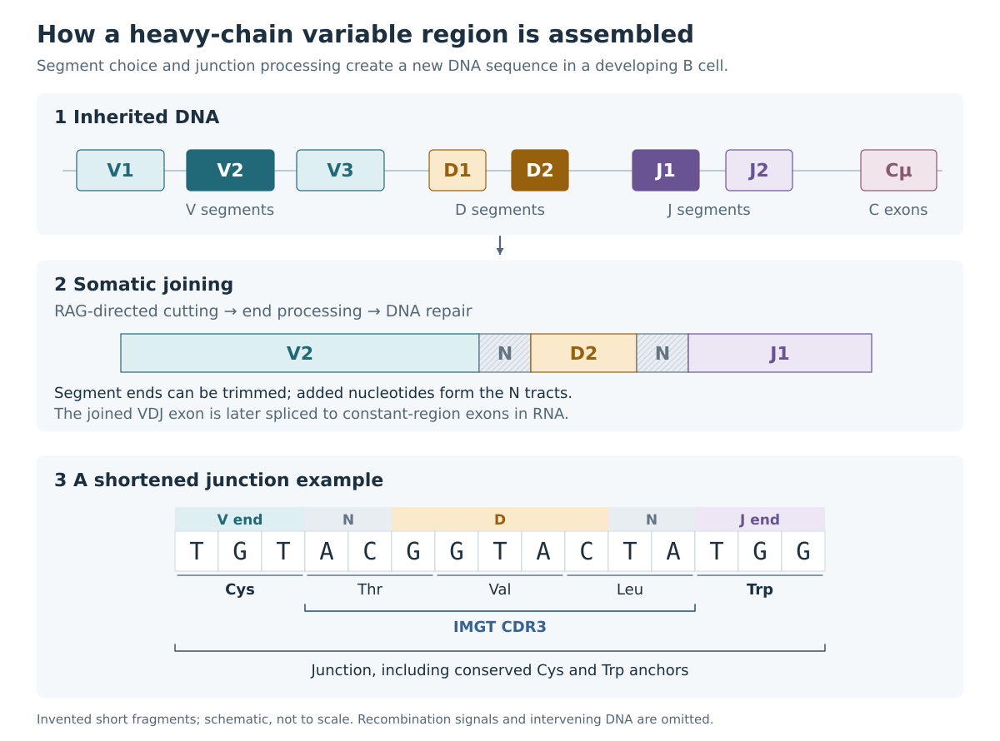

# 2. Building a receptor: V(D)J recombination

A person's inherited genome contains collections of receptor gene segments. During B- and T-cell development, individual cells select and join some of these segments. This changes the DNA of the developing cell and creates a receptor sequence that its descendants can inherit.

The process is called [V(D)J recombination](https://en.wikipedia.org/wiki/V(D)J_recombination). The letters stand for **variable**, **diversity**, and **joining**. Parentheses around D allow the same name to cover chains assembled from V and J alone. ([R03](references.md#r03))

*Figure 1. Assembly of an illustrative heavy-chain variable region. Segment selection and junction processing both contribute to diversity. The enlarged junction uses deliberately shortened, invented sequence fragments. The constant-region exons lie downstream and enter the mature transcript through RNA processing.*

## What “germline” means

The [germline](https://en.wikipedia.org/wiki/Germline) is the lineage of cells through which genetic material passes between generations. In receptor analysis, a **germline sequence** usually means the inherited sequence of a receptor gene segment before receptor rearrangement and somatic mutation.

A **rearranged sequence** is the product assembled in a particular lymphocyte. It includes a chosen set of inherited segments and the DNA created at their joins. Repertoire analysis repeatedly compares these two levels: the inherited segment catalogue and the receptors assembled from it.

A [locus](https://en.wikipedia.org/wiki/Locus_(genetics)) is a position or region in the genome. Receptor-locus abbreviations identify the chain being analysed:

| Receptor chain | Locus | Usual variable-region assembly |
|---|---|---|
| Antibody heavy | `IGH` | V–D–J |
| Antibody kappa light | `IGK` | V–J |
| Antibody lambda light | `IGL` | V–J |
| TCR alpha | `TRA` | V–J |
| TCR beta | `TRB` | V–D–J |
| TCR gamma | `TRG` | V–J |
| TCR delta | `TRD` | V–D–J; more than one D can contribute |

These distinctions determine which segment types an analysis should search for. In particular, ordinary light-chain and TCR-alpha rearrangements have a V–J junction. ([R03](references.md#r03), [R04](references.md#r04))

## Cutting and joining DNA

The proteins [RAG1](https://en.wikipedia.org/wiki/RAG1) and [RAG2](https://en.wikipedia.org/wiki/RAG2) recognize [recombination signal sequences](https://en.wikipedia.org/wiki/Recombination_signal_sequences) beside receptor gene segments and initiate DNA cutting. Cellular DNA-repair machinery then joins the coding ends, largely through [non-homologous end joining](https://en.wikipedia.org/wiki/Non-homologous_end_joining).

For an antibody heavy chain, D generally joins to J first, followed by V joining to DJ. The arrangement and accessibility of the locus constrain the available joins. In some configurations intervening DNA is excised; in others a rearrangement inverts DNA.

Choosing different V, D, and J segments creates **combinatorial diversity**. The pairing of two independently assembled receptor chains adds another level of diversity. Segment use is uneven: genomic organization, developmental regulation, and subsequent cell selection all affect which receptors are observed. ([R08](references.md#r08), [R22](references.md#r22))

## The joins create additional sequence

The coding ends undergo processing before they are sealed. Bases can be removed from the ends of the chosen segments. Opening a hairpin-shaped DNA end can generate short palindromic additions, called **P nucleotides**. The enzyme [terminal deoxynucleotidyl transferase](https://en.wikipedia.org/wiki/Terminal_deoxynucleotidyl_transferase), or TdT, can add bases without copying a DNA template; these are **N nucleotides**.

Consequently, two cells that choose the same V, D, and J segments can assemble different receptors. They may trim different numbers of bases or add different junction sequences. This is [junctional diversity](https://en.wikipedia.org/wiki/Junctional_diversity).

“N addition” describes how a base arose. The actual added bases are A, C, G, or T. Separately, the symbol `N` in a sequence file means that the nucleotide is unknown or unspecified. A reconstructed germline guide often uses `N` to mark junction positions whose ancestral bases remain unresolved. ([R03](references.md#r03), [R08](references.md#r08))

## CDR3 spans the join

A V segment supplies most of the variable-region sequence, including CDR1, CDR2, and much of the framework. CDR3 spans the end of V, the junctional additions, any retained D sequence, and the beginning of J. The remainder of J contributes to the end of the variable domain.

Region definitions use conserved landmarks. Under the IMGT convention, the **junction** includes the conserved cysteine near the end of V and the conserved phenylalanine or tryptophan in J. **CDR3** lies between those anchor residues. Software fields should be compared using their declared convention, because including the two anchors changes both the sequence and its length. ([R13](references.md#r13))

A short sequence in the middle of a junction might match a D segment, or it might have arisen through added bases. Heavy trimming and later mutation make that distinction harder. D assignments consequently tend to carry more ambiguity than assignments based on a long V region.

Occasionally, evidence supports two D segments in one rearrangement, written **V–D–D–J**. Such histories are biologically possible, with their prevalence and interpretation depending on the locus and species. A long junction alone provides limited evidence: a single D with added bases, mutation, or an unusual alignment can produce a similar pattern. ([R15](references.md#r15))

## A rearrangement must encode a usable chain

Proteins are translated from DNA in three-base units called [codons](https://en.wikipedia.org/wiki/Codon). Junctional changes can alter the [reading frame](https://en.wikipedia.org/wiki/Reading_frame) or introduce a [stop codon](https://en.wikipedia.org/wiki/Stop_codon). Many rearrangements therefore fail to encode an intact receptor chain.

A **productive rearrangement** satisfies sequence-level requirements consistent with producing a functional chain, including an appropriate frame and absence of disruptive stops. A developing cell must also assemble the chain with its partner, display a receptor, and pass developmental selection. Some cells carry an unsuccessful rearrangement alongside a successful one, so a sequencing dataset can contain non-productive records even when it came from living lymphocytes. ([R04](references.md#r04))

Successful receptor expression commonly feeds back to limit further rearrangement. [Allelic exclusion](https://en.wikipedia.org/wiki/Allelic_exclusion) helps most B cells express one dominant heavy-chain specificity. The regulation differs among loci; TCR-alpha expression, for example, allows more exceptions to a single expressed chain.

V(D)J recombination establishes a cell's starting receptor. In B cells, an immune response can subsequently introduce another layer of sequence change: somatic hypermutation.

---

[Previous: Recognition and receptors](01-recognition-and-receptors.md) · [Contents](index.md) · [Next: B-cell responses](03-b-cell-responses.md)
