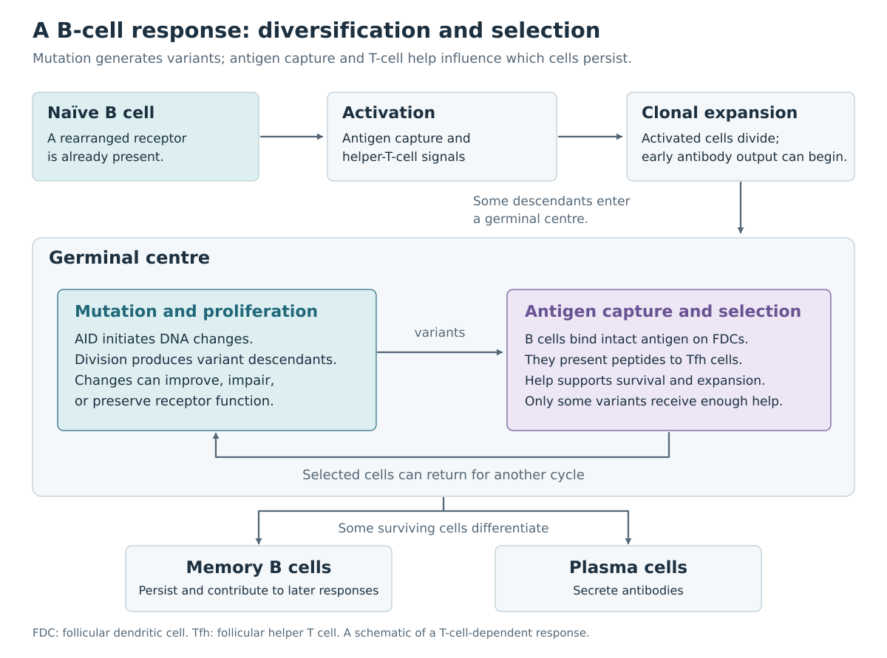

# 3. B-cell responses: activation, mutation, and memory

A mature [naive B cell](https://en.wikipedia.org/wiki/Naive_B_cell) has assembled and expressed a receptor but has yet to enter an antigen-driven response. Naive B cells circulate and visit lymphoid tissues, where antigens and other immune cells are brought together.

Development also subjects B cells to [immune tolerance](https://en.wikipedia.org/wiki/Immune_tolerance) mechanisms. Strong self-reactivity can lead to further light-chain rearrangement, called [receptor editing](https://en.wikipedia.org/wiki/Receptor_editing), to deletion of the cell, or to a less responsive state called [anergy](https://en.wikipedia.org/wiki/Clonal_anergy). Further checks operate after development. These processes shape the repertoire that an experiment samples. ([R04](references.md#r04), [R07](references.md#r07))

## Antigen recognition and T-cell help

When a BCR binds antigen, associated signalling proteins transmit information into the cell. The B cell can also internalize the bound material, break proteins into peptides, and display some of those peptides on MHC class II molecules.

A suitable helper T cell can recognize one of these peptide–MHC complexes and provide additional signals. These include contact between [CD40](https://en.wikipedia.org/wiki/CD40_(protein)) on the B cell and CD40 ligand on the T cell, as well as [cytokines](https://en.wikipedia.org/wiki/Cytokine), which are secreted signalling proteins.

The B cell and T cell recognize different forms of linked material. For example, the BCR might bind a surface patch on a viral protein while the TCR recognizes an internal peptide from that protein. This is **linked recognition**. It connects the B cell's ability to collect a particular antigen with help from a T cell responding to material acquired with it. ([R02](references.md#r02))

Many responses to protein antigens depend on this cooperation. Some antigens, including certain repetitive microbial carbohydrates, can also stimulate [T-independent responses](https://en.wikipedia.org/wiki/T_independent_antigen_(TI)) through other combinations of signals.

## Expansion and early antibody production

An activated B cell can divide repeatedly, producing a [clone](https://en.wikipedia.org/wiki/Clone_(cell_biology)): a family of descendants from the same ancestral B cell. Early in a response, some descendants become antibody-secreting cells outside germinal centres. Other descendants enter a germinal-centre response.

The receptor rearrangement is inherited when a cell divides. Once mutations begin accumulating, members of a clone can carry distinct but related receptor sequences. “Clonal family” therefore encompasses the family's sequence variation. ([R02](references.md#r02), [R10](references.md#r10))

*Figure 2. A simplified protein-antigen response. In the germinal centre, B cells repeatedly divide, acquire mutations, and compete for antigen and T-cell help. Cells leaving the response can contribute to memory or antibody secretion. The diagram emphasizes the cycle that generates related antibody sequences.*

## Somatic hypermutation changes the receptor DNA

A [germinal centre](https://en.wikipedia.org/wiki/Germinal_center) is a temporary structure within a lymphoid follicle where activated B cells diversify and undergo selection. In its dark zone, B cells proliferate and acquire mutations in their rearranged immunoglobulin variable-region genes.

[Somatic hypermutation](https://en.wikipedia.org/wiki/Somatic_hypermutation), or **SHM**, is initiated by [activation-induced cytidine deaminase](https://en.wikipedia.org/wiki/Activation-induced_cytidine_deaminase), usually shortened to **AID**. AID converts cytosine in DNA to uracil. Replication and the processing of these lesions by DNA-repair pathways can generate substitutions at the affected base and at nearby positions. Error-prone repair broadens the resulting mutation spectrum. Both heavy- and light-chain variable regions can change. ([R09](references.md#r09), [R30](references.md#r30))

Mutation probabilities depend on the surrounding sequence. Some short motifs are **hotspots**, with relatively high mutation probability; others mutate less frequently. AID targeting and downstream repair contribute different preferences. A mutation also changes its neighbours' sequence context, potentially changing their later mutation probabilities. Insertions and deletions occur as well, although substitutions account for much of the variation commonly analysed. ([R11](references.md#r11))

The resulting variants have a range of properties. Some bind antigen more effectively. Others have little functional effect, reduce binding, destabilize the receptor, or introduce self-reactivity.

## Selection produces affinity maturation

In the germinal centre's light zone, B cells acquire antigen displayed by [follicular dendritic cells](https://en.wikipedia.org/wiki/Follicular_dendritic_cell). These cells retain antigen in a form that BCRs can bind. A B cell then presents processed peptides to [T follicular helper cells](https://en.wikipedia.org/wiki/Follicular_B_helper_T_cells), or Tfh cells.

Cells that acquire and present antigen effectively can receive more help and undergo further proliferation. Repeated mutation and differential survival change the family's composition. Experimental work has linked the amount of T-cell help received to the number of subsequent B-cell divisions. ([R10](references.md#r10))

The progressive improvement in binding that can result is [affinity maturation](https://en.wikipedia.org/wiki/Affinity_maturation). **Affinity** describes the strength of an individual binding interaction. **Avidity** describes the combined effect of multiple interactions, such as several binding sites engaging a multivalent antigen. These measurements depend on the assay and molecular arrangement.

An increased mutation count establishes that a sequence is more different from its inferred starting template. Measuring affinity requires a binding experiment. Even within a successful family, different branches may specialize on different variants of an antigen or accumulate changes with little effect on binding.

## Class switching changes antibody function

Most mature naive B cells express IgM and IgD using the same rearranged heavy-chain variable region. Their co-expression generally comes from alternative RNA processing.

During a response, [class-switch recombination](https://en.wikipedia.org/wiki/Immunoglobulin_class_switching) can connect the rearranged variable-region DNA to a different heavy-chain constant region. Switching typically deletes intervening DNA between switch regions. AID is also required for this process. The variable-region sequence is retained through the switch itself, while SHM can continue changing it over the family's history. ([R08](references.md#r08), [R09](references.md#r09))

The resulting [isotypes](https://en.wikipedia.org/wiki/Isotype_(immunology)) have different distributions and interactions. IgM can form multimeric secreted molecules. IgG is prominent in blood and tissues. IgA contributes importantly to mucosal secretions. IgE can engage mast cells and participates in responses to parasites and in allergic reactions. Subclasses add further distinctions. ([R05](references.md#r05))

A clonal family can consequently contain IgM, IgG, or IgA members sharing the same original rearrangement. A constant-region call can help identify this diversity when the read covers enough informative constant sequence.

## Memory and persistent antibody

Some descendants become [memory B cells](https://en.wikipedia.org/wiki/Memory_B_cell), which can participate in later responses. Others become long-lived plasma cells, maintaining antibody secretion from supportive tissue environments. Memory B cells and plasma cells are distinct outcomes: one preserves a responsive cell population, while the other can sustain circulating antibody.

Memory populations include cells with different mutation burdens and isotypes. An IgM sequence can come from an antigen-experienced cell, and a low-mutation sequence can still contribute useful antigen recognition. Cell phenotype, sampling time, tissue, and sequence history together provide the context for interpretation. ([R05](references.md#r05))

---

[Previous: V(D)J recombination](02-vdj-recombination.md) · [Contents](index.md) · [Next: T-cell responses](04-t-cell-responses.md)
