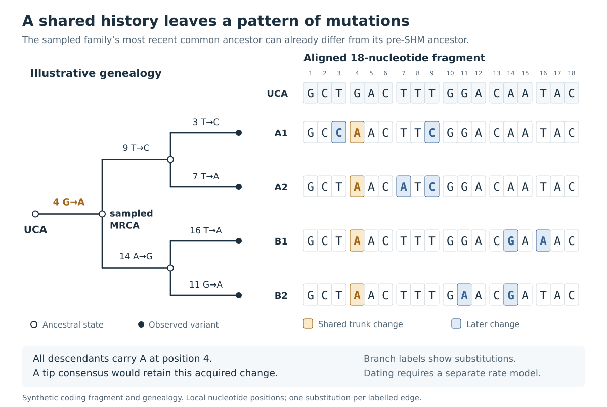

# 10. Mutations, alignments, and trees

A B-cell family contains related versions of a rearranged receptor. Some changes are shared by many members; others occur in only one observed variant. Mutation summaries describe the amount and location of change. An alignment identifies corresponding positions. A tree proposes the branching history that connects the variants.

## Measuring sequence differences from an inherited reference

A simple measure of V-region SHM is the fraction of comparable V positions that differ from the assigned germline reference. If 12 of 240 compared nucleotides differ, the measured fraction is 12/240 = 5%.

Swig's V-SHM summaries compare concrete `A`, `C`, `G`, and `T` bases in the sequence and its assigned reference. Ambiguous or gapped comparisons are excluded from this mismatch denominator. The aligned span and coverage therefore matter alongside the percentage. A short read covering a highly variable region can produce a different percentage from a complete V region in the same family. ([S09](references.md#s09))

This is a measure of **present-day differences**. Several mutation events can affect one position, and a later mutation can restore its original base. Twelve differences can therefore result from more than twelve historical substitutions. Missing inherited alleles and technical errors can also contribute differences, as explained in Chapters 7 and 8.

The V reference supplies an inherited baseline for its covered contribution. Junction sequence requires more reconstruction because recombination trimmed the segment ends and added bases. A difference between a CDR3 and an arbitrary V–D–J concatenation cannot be interpreted as ordinary SHM without accounting for those processes.

## Nucleotide changes and protein changes

A [codon](https://en.wikipedia.org/wiki/Genetic_code) is a three-nucleotide unit specifying an amino acid. A **synonymous** change preserves that amino acid; a **replacement**, or nonsynonymous, change alters it. For example, `TTT` and `TTC` both encode phenylalanine, while `ATC` encodes isoleucine.

Counting changed codons differs from counting changed bases. A codon with two nucleotide differences contributes two base mismatches but one altered codon. Its amino-acid consequence depends on the complete resulting triplet. Swig reports nucleotide and codon-level summaries, including synonymous and replacement categories and regional breakdowns. ([S09](references.md#s09))

The [complementarity-determining regions](https://en.wikipedia.org/wiki/Complementarity-determining_region), or CDRs, often contact antigen. Framework regions support the domain's structure and can also affect binding, stability, or expression. Comparing regions can reveal where a family's differences occur, but mutation opportunity varies with sequence context and codon composition.

A high replacement count in a CDR is consequently insufficient by itself to quantify positive selection. A selection analysis needs a suitable expectation for mutation targeting and the changes that the genetic code permits. Synonymous changes are often useful for learning mutation patterns, although their survival in sampled lineages can still depend on linked selection and other biological effects. ([R11](references.md#r11))

## SHM burden and affinity

AID-associated mutational processes target some sequence contexts more often than others. A hotspot is a context with an elevated mutation probability. Mutations also change the contexts seen by later rounds of the process. This helps explain why the same positions can change repeatedly in separate families. ([R11](references.md#r11))

Selection acts on cells carrying the resulting receptors. Some mutations improve binding to the antigen encountered; some impair it; others have little effect on that interaction or alter a different property. Mutation burden alone therefore gives an incomplete account of affinity maturation. A highly mutated antibody may bind the current experimental antigen poorly, and an antibody with few mutations may bind it well.

Binding assays measure [affinity](https://en.wikipedia.org/wiki/Binding_affinity) under defined conditions. Neutralization and other functional assays ask additional questions. Sequence summaries help choose variants and hypotheses for those experiments.

## Aligning members of a family

A [multiple sequence alignment](https://en.wikipedia.org/wiki/Multiple_sequence_alignment) arranges sequences in rows so that each column represents a proposed homologous position: bases descended from the same ancestral position.

When all family members have the same length and differ only by substitutions, alignment is relatively straightforward. Insertions, deletions, and incomplete ends make it harder. A gap can represent a biological deletion, space inserted to align another sequence's insertion, or an unobserved end. These situations need different interpretations.

Swig provides reference-projected alignments and de novo alignment choices, including nucleotide and codon-aware routes. Projection onto a common reference is convenient for inspecting calls; de novo alignment can reconsider how insertions relate across members. A codon-aware route aligns protein sequence and transfers the alignment back to nucleotide triplets, preserving the reading-frame structure of the variable domain. ([S11](references.md#s11))

An alignment error can manufacture a run of apparent substitutions or an implausible indel. Before interpreting such a region, inspect the surrounding sequence, reading frame, read coverage, and available raw evidence. Manual curation should preserve the original data and record the change, especially when bases rather than gap placement are edited.

## What a phylogeny represents

A [phylogenetic tree](https://en.wikipedia.org/wiki/Phylogenetic_tree) proposes relationships among sequences through common ancestry. For a B-cell family, the underlying process is cell division and receptor mutation. Each branching event in the reconstructed tree summarizes a divergence in the histories represented by the sampled sequences.

A **tip**, or leaf, usually represents an observed sequence record or unique variant. Its count may stand for many molecules or cells. An **internal node** represents an inferred ancestral state. Many real divisions leave no distinguishing receptor mutation, so sequence data cannot resolve every cell division.

*Figure 3. An invented genealogy and shortened sequence fragment. Every labelled edge carries one substitution. A shared change at position 4 occurred before the sampled branches diverged, so it is present in all four descendants. The tree's unmutated starting sequence differs from their most recent common ancestor. Sequence positions are local to this example; branch lengths do not represent elapsed time.*

Closely related sequences share both inherited starting sequence and mutations acquired before their divergence. A tree separates shared changes from changes that occurred on later branches. The figure's shared position-4 change requires one event on the trunk rather than four independent events at the tips.

## Inferring a tree from an alignment

A sequence-evolution model assigns probabilities to changes along branches. [Maximum likelihood](https://en.wikipedia.org/wiki/Maximum_likelihood_estimation) inference searches for a tree and parameters under which the observed alignment is comparatively probable. The result depends on the alignment, model, and extent of the search. ([R27](references.md#r27))

Swig uses FastTree for its standard tree-building route and also accepts an uploaded tree. FastTree makes an approximate maximum-likelihood search that is practical for many sequences. The standard nucleotide workflow uses a general time-reversible substitution model. ([S11](references.md#s11), [R28](references.md#r28))

A **branch length** commonly estimates substitutions per site under the fitted model. Translating that length into calendar time would require an additional rate model and suitable temporal information. In an antibody response, opportunities for mutation depend on activation and proliferation history, making a simple universal clock a poor default.

Small sequence differences can leave several branching orders plausible. A tree viewer displays one chosen topology; short or collapsed branches often deserve attention to that underlying ambiguity. Additional sequences help only to the extent that they add informative variation and appropriate sampling.

## Rooting and germline guides

The [root](https://en.wikipedia.org/wiki/Phylogenetic_tree) gives a tree its direction from ancestors toward descendants. In a B-cell analysis, inherited segment sequence provides useful information about the starting end of the history.

Swig can build a synthetic germline guide from selected V and J references, leaving uncertain junction positions masked. The standard display tree can include this guide and be rooted on it. The workbench also offers consensus and heuristic comparison sequences. Their construction determines which parts are evidence from the family and which parts are assumptions or unresolved sequence. ([S11](references.md#s11))

A guide helps orient a display. Reconstructing the actual joined pre-SHM sequence requires considering trimming, added bases, and the changes shared by all sampled descendants. That is the subject of [Chapter 11](11-unmutated-common-ancestors.md).

## Mapping changes onto a tree

Once a tree is fixed, ancestral states can be estimated at its internal nodes. [Maximum parsimony](https://en.wikipedia.org/wiki/Maximum_parsimony_(phylogenetics)) chooses explanations with as few changes as possible under the chosen rules. Several assignments can tie when the data are ambiguous.

Swig's ancestral mutation display uses nucleotide parsimony with constraints from known germline positions. Its amino-acid display groups consequences by codon, so synonymous nucleotide changes disappear from the protein-level view. This is useful for following candidate binding-site changes along branches. The separate phylogenetic UCA analysis uses a probabilistic sequence reconstruction with a recombination prior. ([S11](references.md#s11), [S13](references.md#s13))

A labelled mutation belongs to an inferred branch under the displayed reconstruction. It can be a useful experimental candidate without being established as the cause of expansion or increased affinity. Related mutations travel together, and a successful branch may owe its expansion to another change, antigen availability, or cell-level circumstances.

## Combining the tree with metadata

Sample date, tissue, isotype, and abundance can be displayed alongside variants. These annotations help locate questions: which branches appear in a later sample, where an isotype is observed, or whether one variant dominates a sample.

The metadata report observations on sampled material. Class switching changes constant-region DNA, while the variable-region tree is usually inferred from a different part of the sequence. Inferring the number and direction of switching events would require an additional analysis with appropriate biological constraints. Similarly, reconstructing migration between tissues requires accounting for unsampled cells and locations.

A useful family analysis brings together the alignment, tree, mutation annotations, and sample information. Each supplies evidence about a different part of the history.

---

[Previous: Repertoires and clonal families](09-repertoires-and-clones.md) · [Contents](index.md) · [Next: Unmutated common ancestors](11-unmutated-common-ancestors.md)
